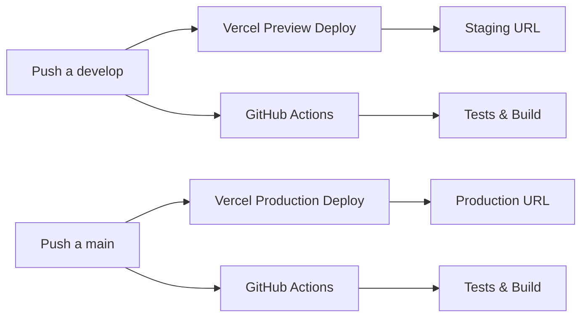

# 🚀 Despliegue en Vercel - Montañez Lab

Esta guía explica cómo configurar y desplegar el proyecto Montañez Lab en Vercel con diferentes entornos (staging y producción).

## 📋 Prerrequisitos

- ✅ Cuenta en [Vercel](https://vercel.com)
- ✅ Proyecto conectado a GitHub
- ✅ Variables de entorno configuradas

## 🔗 Conectar Proyecto a Vercel

### **Opción 1: Desde GitHub (Recomendado)**

1. **Ir a [Vercel Dashboard](https://vercel.com/dashboard)**
2. **Hacer clic en "New Project"**
3. **Importar desde GitHub**: `ymontanezt/montanez-lab-web`
4. **Configurar proyecto**:
   - **Framework Preset**: Next.js
   - **Root Directory**: `/` (por defecto)
   - **Build Command**: `bun run build`
   - **Install Command**: `bun install`
   - **Output Directory**: `.next`

### **Opción 2: Desde CLI**

```bash
# Agregar Vercel al PATH
export PATH="/Users/ymontanez/.bun/bin:$PATH"

# Hacer login en Vercel
vercel login

# Configurar proyecto
vercel
```

## 🌍 Configuración de Entornos

### **1. Entorno de Producción (main)**

**Variables de Entorno:**

```bash
# Configuración del Sitio
NEXT_PUBLIC_SITE_NAME=Montañez Lab
NEXT_PUBLIC_SITE_DESCRIPTION=Laboratorio Dental
NEXT_PUBLIC_SITE_URL=https://montanez-website.web.app
NEXT_PUBLIC_DEBUG=false

# Firebase - Producción
NEXT_PUBLIC_FIREBASE_API_KEY=tu_api_key_produccion
NEXT_PUBLIC_FIREBASE_AUTH_DOMAIN=tu_proyecto.firebaseapp.com
NEXT_PUBLIC_FIREBASE_PROJECT_ID=tu_proyecto_id
NEXT_PUBLIC_FIREBASE_STORAGE_BUCKET=tu_proyecto.appspot.com
NEXT_PUBLIC_FIREBASE_MESSAGING_SENDER_ID=tu_sender_id
NEXT_PUBLIC_FIREBASE_APP_ID=tu_app_id

# Email
RESEND_API_KEY=tu_resend_api_key
RESEND_FROM_EMAIL=montzavy@gmail.com
RESEND_FROM_NAME=Montañez Lab

# Entorno
NODE_ENV=production
```

### **2. Entorno de Staging (develop)**

**Variables de Entorno:**

```bash
# Configuración del Sitio
NEXT_PUBLIC_SITE_NAME=Montañez Lab (Staging)
NEXT_PUBLIC_SITE_DESCRIPTION=Laboratorio Dental - Entorno de Pruebas
NEXT_PUBLIC_SITE_URL=https://staging.montanez-website.web.app
NEXT_PUBLIC_DEBUG=true

# Firebase - Staging (mismo proyecto, diferentes configuraciones)
NEXT_PUBLIC_FIREBASE_API_KEY=tu_api_key_staging
NEXT_PUBLIC_FIREBASE_AUTH_DOMAIN=tu_proyecto.firebaseapp.com
NEXT_PUBLIC_FIREBASE_PROJECT_ID=tu_proyecto_id
NEXT_PUBLIC_FIREBASE_STORAGE_BUCKET=tu_proyecto.appspot.com
NEXT_PUBLIC_FIREBASE_MESSAGING_SENDER_ID=tu_sender_id
NEXT_PUBLIC_FIREBASE_APP_ID=tu_app_id

# Email
RESEND_API_KEY=tu_resend_api_key_staging
RESEND_FROM_EMAIL=montzavy@gmail.com
RESEND_FROM_NAME=Montañez Lab (Staging)

# Entorno
NODE_ENV=staging
```

## 🔐 Configurar Variables de Entorno en Vercel

### **Desde Dashboard de Vercel:**

1. **Ir al proyecto** en Vercel Dashboard
2. **Settings** → **Environment Variables**
3. **Agregar variables** para cada entorno:

#### **Para Producción (main):**

- **Environment**: Production
- **Variable**: `NEXT_PUBLIC_SITE_URL`
- **Value**: `https://montanez-website.web.app`

#### **Para Staging (develop):**

- **Environment**: Preview
- **Variable**: `NEXT_PUBLIC_SITE_URL`
- **Value**: `https://staging.montanez-website.web.app`

### **Desde CLI:**

```bash
# Configurar variable para producción
vercel env add NEXT_PUBLIC_SITE_URL production

# Configurar variable para staging
vercel env add NEXT_PUBLIC_SITE_URL preview

# Listar variables configuradas
vercel env ls
```

## 🚀 Despliegue Automático

### **Configuración de Git Hooks:**

1. **Vercel detecta automáticamente** los cambios en GitHub
2. **Push a `main`** → Deploy a producción
3. **Push a `develop`** → Deploy a staging
4. **Pull Request** → Deploy preview

### **Configurar Dominios:**

#### **Producción:**

- **Dominio principal**: `montanez-website.web.app`
- **Subdominio**: `www.montanez-website.web.app`

#### **Staging:**

- **Subdominio**: `staging.montanez-website.web.app`

## 📱 Configuración de Dominios en Vercel

### **1. Agregar Dominio Personalizado:**

1. **Vercel Dashboard** → **Settings** → **Domains**
2. **Add Domain** → `montanez-website.web.app`
3. **Configurar DNS** según las instrucciones de Vercel

### **2. Configurar DNS:**

```bash
# Registrar A
montanez-website.web.app → 76.76.19.34

# Registrar CNAME
www.montanez-website.web.app → cname.vercel-dns.com

# Subdominio staging
staging.montanez-website.web.app → cname.vercel-dns.com
```

## 🔄 Workflow de Despliegue

### **Flujo Automático:**



### **Comandos de Despliegue Manual:**

```bash
# Deploy a staging
vercel --target preview

# Deploy a producción
vercel --prod

# Ver estado del deploy
vercel ls

# Ver logs del deploy
vercel logs [deployment-url]
```

## 🛠️ Troubleshooting

### **Error: Build Failed**

```bash
# Verificar variables de entorno
vercel env ls

# Ver logs del build
vercel logs [deployment-url]

# Rebuild local
bun run build
```

### **Error: Environment Variables Missing**

1. **Verificar** que las variables estén configuradas en Vercel
2. **Verificar** que el entorno sea correcto (Production/Preview)
3. **Rehacer deploy** después de configurar variables

### **Error: Domain Not Working**

1. **Verificar** configuración DNS
2. **Esperar** propagación DNS (puede tomar hasta 24 horas)
3. **Verificar** certificado SSL en Vercel

## 📊 Monitoreo y Analytics

### **Vercel Analytics:**

- **Performance**: Core Web Vitals
- **Real Experience**: User metrics
- **Speed Insights**: Page load times

### **Configurar Analytics:**

```bash
# Instalar Vercel Analytics
bun add @vercel/analytics

# Importar en _app.tsx
import { Analytics } from '@vercel/analytics/react'
```

## 🔒 Seguridad

### **Variables Sensibles:**

- ✅ **NEXT*PUBLIC*\*** → Visibles en el cliente
- ❌ **RESEND_API_KEY** → Solo en servidor
- ❌ **FIREBASE\_\*** → Solo en servidor

### **Headers de Seguridad:**

```json
{
  "headers": [
    {
      "source": "/(.*)",
      "headers": [
        {
          "key": "X-Frame-Options",
          "value": "DENY"
        },
        {
          "key": "X-Content-Type-Options",
          "value": "nosniff"
        }
      ]
    }
  ]
}
```

## 📚 Recursos Adicionales

- [Vercel Documentation](https://vercel.com/docs)
- [Next.js on Vercel](https://vercel.com/docs/functions/serverless-functions/runtimes/nodejs)
- [Environment Variables](https://vercel.com/docs/projects/environment-variables)
- [Custom Domains](https://vercel.com/docs/projects/custom-domains)

---

**Última actualización**: $(date)
**Versión**: 1.0.0
